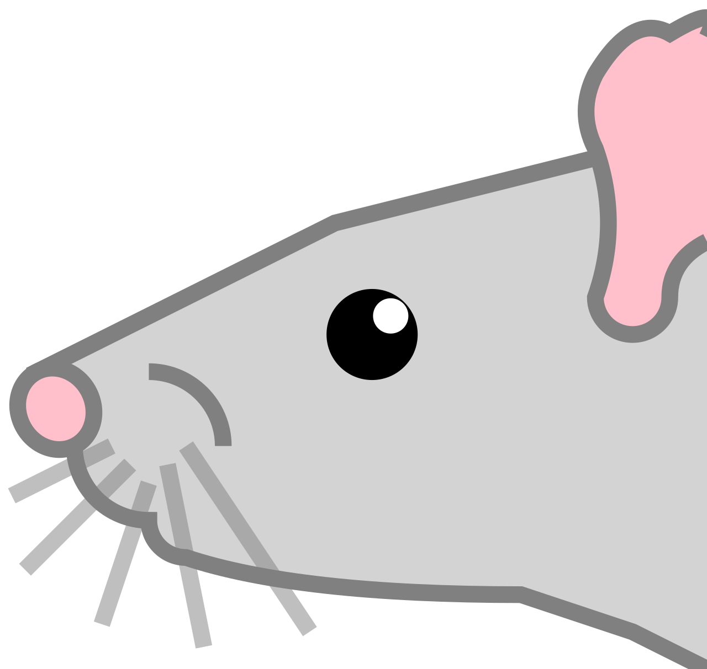
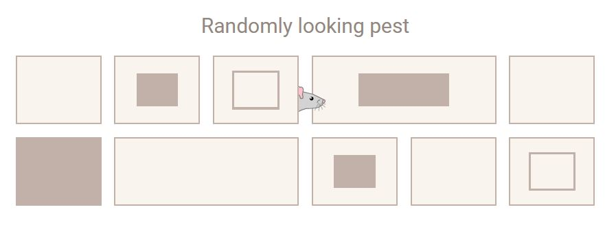

<h1>

Nosy Pests
</h1>

This application is a demo of a nosy-pest tool for adding some pests inside your components.
Only rat can be chosen now but we are planning to draw some other types of pests.

The idea is to register some components in your app to show a random rat besides them from time to time. 
You can set periodicity, direction, size and other animation parameters.

## Available Scripts

This project was bootstrapped with [Create React App](https://github.com/facebook/create-react-app).

### `npm start`

Runs the app in the development mode.\
Open [http://localhost:3000](http://localhost:3000) to view it in the browser.
